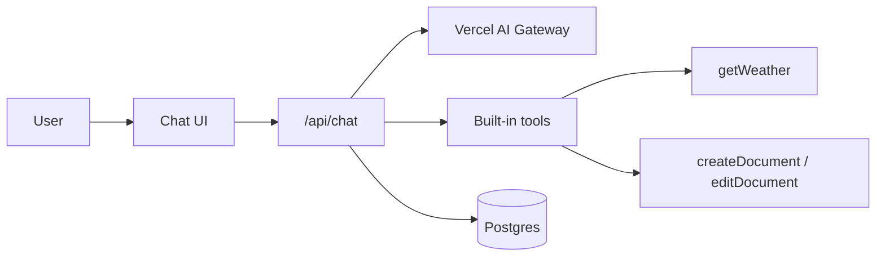
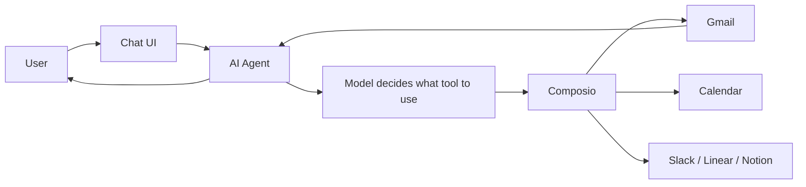
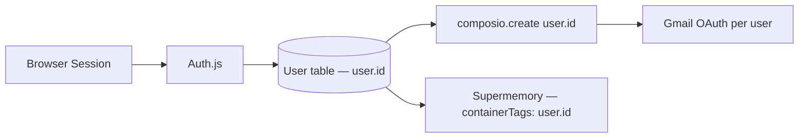
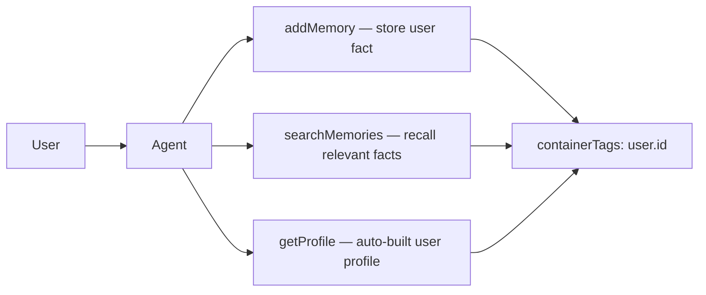
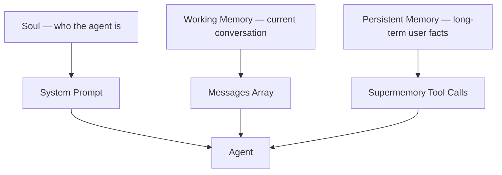
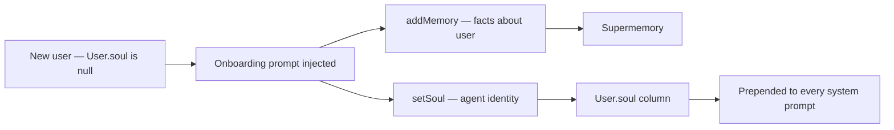
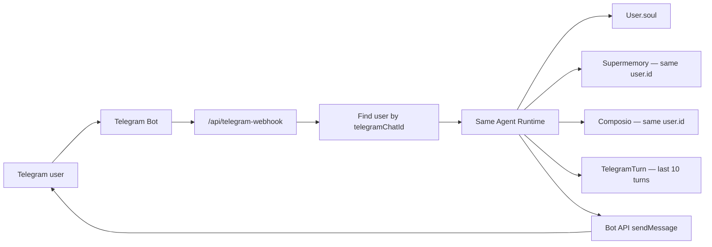
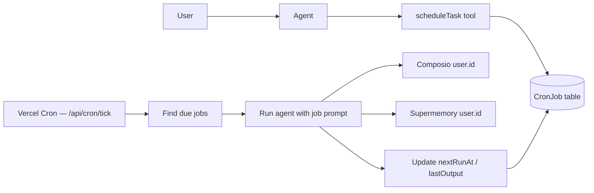

# Tutorial: Build an OpenClaw Clone


## [OVERVIEW] Guiding Idea

We are not rebuilding OpenClaw. We are rebuilding the core ideas in a normal Next.js app, and explaining why each piece exists by mapping it back to what OpenClaw does.

| OpenClaw feature | Our implementation |
|---|---|
| Chat | Vercel AI SDK chatbot template |
| Hands | Composio tools |
| Memory | Supermemory, scoped by `user.id` |
| Soul | `User.soul` + conversational onboarding |
| Anywhere | Telegram bot + account linking |
| Heartbeat | Agent-created cron schedules |

The arc of the whole tutorial:

We start with a chatbot. Then we give it hands, memory, a soul, a second channel, and finally a heartbeat.

---

## [SHOW ON SCREEN] Walk Through openclaw.ai

Open `https://openclaw.ai` in the browser and walk through it for ~60–90 seconds. This sets the bar for what we're cloning, then the core diagram shows how we're cloning it.

[SHOW ON SCREEN]

1. Hero: "The AI that actually does things. Clears your inbox, sends emails, manages your calendar, checks you in for flights. All from WhatsApp, Telegram, or any chat app you already use."
2. Scroll to the **What It Does** grid — point at the six tiles: Runs on Your Machine, Any Chat App, Persistent Memory, Browser Control, Full System Access, Skills & Plugins.
3. Scroll to **Works With Everything** — WhatsApp, Telegram, Gmail, Calendar, Spotify, Hue, Obsidian, etc.
4. Scroll past the **What People Say** wall briefly — just to convey "this is a real thing people care about."

[SPEAKER NOTE] openclaw.ai walkthrough

This is OpenClaw. It's the project everyone's been talking about. Take a quick look at the landing page so we're on the same page about what we're trying to build.

The pitch is simple: an AI that actually does things — emails, calendar, flights, anything you'd hand off to an assistant — and you talk to it from any chat app you already use. WhatsApp, Telegram, iMessage, Discord. Not another chatbot tab in a browser.

Look at the "What It Does" grid: runs on your own machine, persistent memory, full system access, skills and plugins. That's the full feature set.

We are not going to clone all of that. We're going to clone the parts that matter for understanding how a personal AI agent works: chat, hands (tools), memory, soul, a second channel, and a heartbeat. We'll do it as a normal Next.js web app on Vercel — different shape, same core ideas.

A quick note on the "what about security?" question, because that's the loudest thing in the OpenClaw comments. I'll cover it when we connect real tools with Composio, because that's where OAuth actually enters the build.

---


## [ON SCREEN]: Show this diagram on Excalidraw

Show this at the start of the video, and refer back to it before each new part.

Open `excalidraw/1-core-diagram.excalidraw`.

[SPEAKER NOTE FOR DIAGRAM] core diagram

So here's the full picture, and I'll keep coming back to this diagram throughout the tutorial.

The thing I want you to notice is: web chat and Telegram are just two different front doors. The agent itself is the same. It uses the same user id, which means the same Gmail access, the same memory, the same personality — regardless of whether you're chatting from the website or from Telegram.

We're basically rebuilding the core loop of OpenClaw: chat, hands, memory, soul, anywhere, heartbeat. Not all of it. But the important parts.

---

# Introduction

## [SHOW ON SCREEN]

Open the deployed app live:

```text
https://vercel-ai-composio.vercel.app
```

Send a few quick prompts to show it working. No explanation yet, just show it.

Then quickly show:

- `/admin/agent` — agent soul.
- Telegram bot replying.
- `/admin/schedules` — a scheduled task.

## [SHOW ON SCREEN] Quick Trust Slide — Who Am I?

[ON SCREEN]: Show this diagram on Excalidraw: `excalidraw/2-who-am-i-shawn.excalidraw`. Keep this to 20-30 seconds; the goal is trust, not a biography.

[SHOW ON SCREEN] bullets

- Composio DevRel
- Cursor Ambassador
- 4K+ students, 26K+ YouTube
- Shipped AI apps
- JupyterLab contributor

[SPEAKER NOTE] who am I

Quick context on why I'm teaching this. I'm Shawn. I work in developer relations at Composio, I teach developers how to build with AI tools, and I've trained a lot of people on Cursor and agentic coding workflows.

I've also shipped real products with this stuff — a production AI wellness app, AI courses, open-source work in JupyterLab, and internal engineering dashboards before I moved fully into AI education.

I'm not showing you this because I think AI replaces learning how code works. I actually think the opposite. Most software jobs are starting to expect that you can work with AI tools, review their output, and steer them well. So throughout this course I'll show the code, but also the small habits I use when working with AI agents day to day.

## [SPEAKER NOTE] Introduction

So before we build anything, let me show you what we're actually making.

This is a personal AI agent. Not just a chatbot. It can read your Gmail, draft replies, remember things you tell it, and respond from Telegram when you're away from your laptop.

OpenClaw — the AI agent app that's been making rounds on social media — this is roughly what it does. It has a personality, it connects to your tools, it remembers you, and you can message it from anywhere.

By the end of this tutorial, you'll have something that does the same core things. Let me walk you through how we're going to build it.

## FAQ

[ON SCREEN]: Show this diagram on Excalidraw: `excalidraw/3-faq-diagram.excalidraw`.

[SPEAKER NOTE]

And in case you're wondering: do I need to know how to code?

You do not need to be an expert. AI can write a lot of the code, but your job is still to understand what is happening, review the changes, and guide it. We'll use Cursor because it has a free Hobby plan with limited agent requests and no credit card required, but the project is agent-agnostic. Claude Code, Codex, Windsurf, OpenCode, and other coding agents can follow the same prompts.

[SPEAKER NOTE]

And I want to be transparent about costs here. If you're wondering: do I need to pay for an AI coding tool?

Not necessarily. Cursor has a free Hobby plan, and eligible university students can apply for one free year of Cursor Pro. Some other tools, like Claude Code, may require a paid account or credit card depending on availability. Students may also be able to access Claude through Claude for Education, or Codex credits through OpenAI's student program in supported countries. If paid tools are not an option, you can still follow with free or open-source tools like OpenCode, or by copying the prompts into whichever AI coding tool you already have access to.

[SHOW ON SCREEN]

Cycle through these pricing screenshots for about 5 seconds each:

- Cursor pricing: `tutorial/screenshots/cursor-pricing.png`
- Cursor for Students: `tutorial/screenshots/cursor-for-students.png`
- Codex for Students: `tutorial/screenshots/codex-for-students.png`

[SPEAKER NOTE]

And if you're wondering: do I need to pay for AI credits?

For most people, Vercel AI Gateway's free monthly credits should be enough to follow along if you keep your testing reasonable. If you use heavier models a lot, you may need to add credits, switch models, or use provider credits you already have. The important thing is the architecture, not one specific paid model.

[SPEAKER NOTE]

And what about vendor lock-in?

The app uses Vercel AI SDK, so the model provider is swappable. Today I might use Claude or GPT through AI Gateway, but the code is not built around one provider's SDK. The same idea applies to the coding agent: Cursor is what I'm using on screen, but the prompts are plain English and the app is just a normal Next.js repo.

[SPEAKER NOTE]

And do Composio and Supermemory cost money?

Both have free tiers that are enough for this tutorial. Supermemory's free plan includes 1M tokens and 10K search queries per month with no credit card. Composio is free for individual builders to get started. If you're an early-stage startup and need more headroom, Composio runs a Startup Program at `https://composio.dev/startups`. When you apply, include the words "free code camp" in the "How did you find out about Composio?" field and we'll prioritize reviewing it.

---

# Part 1: Start With A Chatbot

## [OVERVIEW]

We're using the Vercel AI SDK chatbot template as our starting point. Vercel already built all the boring stuff — auth, database, streaming, tool rendering, model picker, rate limiting. We're not going to rebuild that. We're going to use it as the base.

## [SHOW ON SCREEN]

Show the deployed template working — not our customized version, the clean template behavior.

Demo prompts:

```text
Write a for loop in Python.
```

```text
Get the weather in Vancouver, BC.
```

```text
Write me a short essay on LLMs.
```

```text
Update the essay to be in Spanish.
```

## [SPEAKER NOTE] Part 1 Demo

So this is the Vercel AI chatbot template. It already works out of the box. I want to show you what it can do before we touch any code.

I can ask it to write code — it generates it and renders it in a side panel. I can ask for the weather — it calls a tool, gets the data, and renders a UI component. I can write an essay and then ask it to update it. It tracks the document across messages.

This is already an agent. It can call tools and use the results. The problem is all these tools only work inside the app. It can check the weather, but it can't check your Gmail. It can write a document, but it can't send an email.

That's what we're going to fix starting in Part 2.

## [ON SCREEN]: Show this diagram on Excalidraw



[SPEAKER NOTE FOR DIAGRAM] Part 1 diagram

Here's what's actually happening under the hood. When you send a message, it goes to our Next.js API route. That route calls the model through Vercel's AI Gateway, which is basically a router that can use any AI model — Claude, GPT, Gemini, whatever. The model decides if it needs to call a tool. If it does, it runs the tool, gets the result, and continues.

Everything here is local. The weather tool calls a public API. The document tool is just in-memory. Composio is going to be how we plug into the real world.

## [SHOW ON SCREEN] Click Path

1. Go to `https://vercel.com/templates/next.js/chatbot`.
2. Click **Deploy**.
3. Create a Vercel account if needed.
4. Set a private repo name.
5. Add resources with default settings:
   - **Neon** — Postgres database, stores users, chats, messages.
   - **Upstash Redis** — resumable streams, rate limiting in production.
   - **Vercel Blob** — file uploads.
6. Clone locally, pull env, install, run:

```bash
npm i -g vercel
vercel link
vercel env pull
pnpm install
pnpm db:migrate
pnpm dev
```

## [SHOW ON SCREEN] Source Code When You Need It

Open the repo only after the local app is running, not in the first minute.

```text
https://github.com/shawnesquivel/OpenClaw-Clone-Composio-VercelAI
```

[SPEAKER NOTE]

Everything I'm building is open source. I'm not leading with the repo because it does not matter until we're actually building. But if you get stuck, the full source is linked in the description, and you can fork it, deploy your own copy, or use it as a reference.


[SPEAKER NOTE] adding resources

When you click Add on these, Vercel provisions the service and automatically injects the connection env vars into your project. You don't configure anything manually. Neon gives us Postgres for storing users and chats. Redis handles rate limiting and resumable streams. Blob is for file uploads.

For this tutorial, local and production are going to share the same database — just to keep things simple. In a real app you'd split environments.

## [CHECKPOINT]

Open `http://localhost:3000` and confirm:

- Chat works.
- Messages persist across refresh.
- Weather tool renders a UI.
- Document artifact panel opens.

---

# Part 2: Give It Hands With Composio

## [OVERVIEW]

Right now the agent can only use tools that we built ourselves. Composio gives it access to 1000+ real-world integrations — Gmail, Calendar, Slack, Linear, Notion, and hundreds more — without writing OAuth flows or API wrappers from scratch.

## [SHOW ON SCREEN]

Open the deployed app. Run:

```text
Look at the 10 latest messages in my email and tell me if anything is urgent.
```

If Gmail is not connected, show the OAuth link the agent returns inline.

If connected, show:

- Tool call cards rendering.
- Gmail results.
- Agent summarizing what it found.

[SPEAKER NOTE] Part 2 demo

Watch what happens when I ask it to check my email.

It's calling tools. Lots of them. It's searching for the right Gmail tool, checking if I'm authenticated, fetching the emails, reading through them, and then summarizing back to me. I didn't write any of that. Composio provides all the Gmail tools. I just had to plug it in.

If I hadn't connected Gmail yet, it would return an OAuth link right here in the chat. Click it, authorize Gmail, come back, and the agent can now access your inbox. That's the "inline auth" flow.

## [ON SCREEN]: Show this diagram on Excalidraw



[SPEAKER NOTE FOR DIAGRAM] Part 2 diagram

Here's what changed from Part 1.

The agent now has a Composio layer in the middle. Instead of only having tools we wrote ourselves, it has access to everything Composio supports. The model decides which tool to call — it might call a search tool first to figure out the right Gmail action, then call that action, then call another one if needed.

The key thing to understand: Composio has one API key for the whole app. But each user's Gmail is separate. We use the logged-in user's ID — their `user.id` from the database — to scope their connected accounts. So your Gmail and my Gmail never mix. That's the "per-user identity" pattern.

Guest users don't get Composio tools. Only real signed-in users.

## Security / OAuth Framing

[SPEAKER NOTE]

This is the moment where the security story actually matters. With Composio, I'm not giving the agent my browser, my shell, or my whole computer. I'm connecting a specific account through OAuth.

OAuth is safer because the user sees the app they're authorizing, the scopes are explicit, and the connection can be revoked. Composio brokers that connection per user, so the app uses my `user.id` to access my Gmail connection, and your `user.id` to access yours.

That does not magically make the whole app production-secure. Prompt injection, confirmation steps before sending emails, audit logs, and kill switches are still real production concerns. But it is a much safer shape than handing an agent an open browser session and saying, "go do whatever."

## 🤖 [SHAWN: COPY AND PASTE PROMPT]

Paste this into your coding agent:

```text
Add Composio tools to the existing Vercel AI SDK chat route.

Context:
- Keep the existing chat UI, streaming flow, and local tools.
- Auth exists. Use session.user.id as the Composio external user id.
- Guest users should not get Composio tools.
- If Composio fails to initialize, log the error and continue with local tools.
- Merge local tools and Composio tools into the existing tools object.
- Keep tool calls visible in the existing message UI.

Verify:
- Regular user: if Gmail is not connected, Composio returns an auth link inline.
- Guest user: no Composio external tools.
- Existing weather/document tools still work.
```

[SPEAKER NOTE] Part 2 prompt

So here's the prompt I'm going to give my coding agent. The key things I want it to do: use the logged-in user's ID for Composio (not a hardcoded ID), make sure guest users don't get access, and if anything goes wrong with Composio initialization, just continue without it — don't crash the whole chat.

The other thing it needs to handle is the UI. Composio tools have dynamic names — the template doesn't know about them in advance. So we need a fallback renderer in our message component that shows any unknown tool call in a generic card.

## [SHOW ON SCREEN] Source Code To Point At

| File | What to point at |
|---|---|
| `app/(chat)/api/chat/route.ts` | `composio.create(session.user.id)`, tools merge, guest check |
| `components/chat/message.tsx` | `type.startsWith("tool-")` fallback block |
| `components/ai-elements/tool.tsx` | label cleanup for dynamic tool names |

## Model Reliability Aside

If a demo fails:

[SPEAKER NOTE]

So I tried this with a cheaper model and it failed. That's actually worth talking about.

For agentic tasks, the model isn't just writing text. It has to pick the right tool, construct valid JSON arguments, track what happened, and decide what to do next. That's a reasoning + reliability problem.

Better models handle this more consistently. Same workflow that fails on a cheaper model might work fine on Claude Sonnet or GPT-4o. It's not that the integration is broken — it's that multi-step tool chains are harder, and model quality matters a lot here.

## [CHECKPOINT]

Run in chat:

```text
Fetch my latest emails.
```

Then show Composio dashboard at `platform.composio.dev` → Logs → Tools. Every tool call is visible there.

[SPEAKER NOTE]

Here's something I really like about Composio. You can see every single tool call in your dashboard. What tool ran, what the input was, what came back. That's really useful for debugging. When a multi-step flow fails, you can trace exactly where it went wrong.

---

# Part 3: Deploy For Real Users

## [OVERVIEW]

Right now if we have two users, they'd share the same Composio account. We need to fix that. Every signed-in user should have their own tool identity, their own connected accounts. And we should be able to see that as the developer.

## [SHOW ON SCREEN]

Open production in an incognito window:

1. Sign up as a new user.
2. Send a chat message.
3. Show Drizzle Studio — new row in `User` and `Message_v2`.
4. Show `/admin` — Composio integration state for this user.

[SPEAKER NOTE] Part 3 demo

So here's the production app. I'm going to open it in incognito as a brand new user.

I sign up, I send a message, and it works. Now I can go to Drizzle Studio — this is a local viewer for our database — and I can see the new user row and their first message. Every user that signs up shows up here.

And if I go to `/admin`, I can see this user's Composio integration state. Which toolkits are connected, which ones are available, the account status. That's the admin dashboard we're building.

## [ON SCREEN]: Show this diagram on Excalidraw



[SPEAKER NOTE FOR DIAGRAM] Part 3 diagram

Here's the key insight. Every user that signs up gets a `user.id` in our Postgres database. That same ID gets passed to `composio.create()` to scope their tool connections. Later, we'll pass the same ID to Supermemory to scope their memory.

So `user.id` is literally the thread that ties everything together. It's how we make sure Alice's Gmail and Bob's Gmail never overlap.

This is the auth-ready pattern. If you're building a real multi-user product, this is where you switch from "demo with hardcoded IDs" to "real per-user identity."

## [SHOW ON SCREEN] Click Path

1. Set `AUTH_SECRET` in Vercel environment variables.

```bash
# generate one
openssl rand -hex 32
```

2. Set the same in `.env.local`.

[SPEAKER NOTE]

`AUTH_SECRET` is what Auth.js uses to sign session cookies. You need it both locally and in production. If it changes, all existing sessions get invalidated. For this tutorial, using the same one everywhere is fine.

## 🤖 [SHAWN: COPY AND PASTE PROMPT]

Paste this into your coding agent:

```text
Move Composio from demo identity to real per-user identity.

Requirements:
- Remove any hardcoded Composio external user id.
- Use session.user.id when calling composio.create().
- Guest users should not connect or use Composio accounts.
- Keep auth flow inline in chat.
- Keep existing streaming and local tools.
- If Composio init fails, log and continue.

Also add an /admin page that shows the current user's Composio integration state:
- user id
- user type
- connected accounts with status badges
- active toolkits
- available toolkits not yet connected
- guest user warning
- Composio missing config state

Use the Next.js connection() + Suspense pattern because this page reads per-user data.
```

[SPEAKER NOTE] Part 3 prompt

Two things happening here: switching to per-user Composio identity, and building the admin page.

The admin page is optional for your end users, but really useful for you as the developer. It answers: "Is this user actually connected to Gmail? Is their account active?" Without it you're debugging blind.

The `connection() + Suspense` pattern is a Next.js thing. Because this page reads live per-user data, we have to tell Next.js not to cache it. That's what `await connection()` does.

## [CHECKPOINT]: Database

```bash
pnpm db:studio
```

Open `https://local.drizzle.studio`. Show:

- `User`
- `Chat`
- `Message_v2`

[SPEAKER NOTE]

So here's our database. Postgres, managed by Drizzle ORM.

The key distinction: Postgres stores the mechanical stuff — users, chats, messages, schedules, Telegram turns. Supermemory stores semantic stuff — what the user told the agent, their preferences, facts about them.

`schema.ts` is the single source of truth. Drizzle generates migration files from it. `db:migrate` applies those to the database. We're not explaining all of this in depth, just know: if you add a column to `schema.ts`, you generate and apply a migration, and it shows up here.

## [CHECKPOINT]: Auth

Show:

- Guest user behavior.
- Sign up.
- Log out and back in.
- New row in `User`.

[SPEAKER NOTE]

Real quick — this is the auth flow. Guest users can chat, but they can't connect external tools and they don't get memory. As soon as you sign up, you get a permanent ID, and all the good stuff unlocks.

---

# Part 4: Give It Memory With Supermemory

## [OVERVIEW]

The agent can answer questions, but it forgets everything between sessions. We're going to add Supermemory so it can remember things about you — permanently, across sessions, and across channels.

## [SHOW ON SCREEN]

In web chat:

```text
Remember that my name is Shawn and I'm learning Japanese.
```

Then start a fresh chat:

```text
What do you know about me?
```

Show `searchMemories` or `getProfile` tool call firing.

[SPEAKER NOTE] Part 4 demo

So I tell the agent my name and that I'm learning Japanese. Now I start a completely new chat — different chat ID, totally fresh context — and ask what it knows about me.

Watch the tool calls. It's calling `searchMemories` or `getProfile`. That's querying Supermemory, which is a vector database scoped to my user ID. It comes back with what I told it in the previous session.

This is one of the core things that makes it feel like an agent rather than a chatbot. A chatbot forgets you. This agent doesn't.

## [ON SCREEN]: Show this diagram on Excalidraw



[SPEAKER NOTE FOR DIAGRAM] Part 4 diagram

Here's how memory works.

Supermemory gives the model three tools. `addMemory` stores a fact. `searchMemories` finds relevant facts by meaning, not exact text. `getProfile` gives you a built-up summary of what Supermemory knows about the user — static facts like their name and role, and dynamic context like what they've been working on recently.

All three are scoped by a `containerTag` which is just the user's ID. So Shawn's memory and Alice's memory never cross.

The model decides when to call these. If you tell it your name, it calls `addMemory`. If you ask what it knows about you, it calls `searchMemories` or `getProfile`. We give it instructions in the system prompt to do this aggressively — don't wait for the user to say "remember this", just do it when the information seems worth keeping.

## Three Memory Layers

Before implementing, show this diagram.



[SPEAKER NOTE FOR DIAGRAM] memory layers

There are actually three memory layers here, and it's worth naming them because we'll keep referring to them.

Soul is who the agent is — its personality and identity. That goes in the system prompt.

Working memory is what we've talked about in this conversation. That's the messages array — the last N turns of the chat.

Persistent memory is what the agent knows about you across all sessions and channels. That's Supermemory. The model can access it by calling tools.

We'll add the soul in the next section. For now, we're just adding persistent memory.

## 🤖 [SHAWN: COPY AND PASTE PROMPT]

```text
Add Supermemory tools to the existing chat route.

Requirements:
- Use @supermemory/tools/ai-sdk.
- Only enable for non-guest users.
- Scope memory with containerTags: [session.user.id].
- Merge memory tools with existing local tools and Composio tools.
- Update the system prompt so the model knows:
  - addMemory stores durable user facts — call it when the user shares anything worth keeping
  - searchMemories/getProfile should be used before answering questions about the user
  - memory is shared across web and Telegram (same containerTag)
  - user facts go to addMemory, NOT into the system prompt
```

[SPEAKER NOTE] Part 4 prompt

The most important part of this prompt is the system prompt instruction. We're telling the model to be aggressive about storing and recalling memory. If someone says "by the way, my name is Shawn" in the middle of a work conversation, the model should still call `addMemory`. Don't wait to be asked.

We also have to tell it not to auto-fetch memory on every turn — that would add latency to every single message even when the user is just chatting about code. Let the model decide when it needs memory.

## [CHECKPOINT]

Run:

```text
Remember my favorite food is sushi.
```

New chat:

```text
What is my favorite food?
```

Show `addMemory` and `searchMemories` tool calls.

[SPEAKER NOTE]

If it doesn't work, the most likely reason is the model didn't call `addMemory`. Memory is model-driven — the model has to decide to store it. That's why the system prompt wording matters. If the model ignores short casual facts, tighten the language in the prompt.

---

# Part 5: Give It A Soul

## [OVERVIEW]

OpenClaw has a file called `SOUL.md`. It's what gives the agent its personality — how it talks, what it values, what it refuses to do. We're going to do the same thing, but instead of a file, it's a column in our database. One per user, editable from the app.

## [SHOW ON SCREEN]

Reset soul to null at `/admin/agent`, then go to web chat and type:

```text
hi
```

Show the onboarding flow:

- Agent asks your name.
- You answer. `addMemory` fires.
- Agent asks what to call itself / preferred vibe.
- You answer.
- Agent calls `setSoul`.
- Go to `/admin/agent` — textarea is now populated with the generated soul.

[SPEAKER NOTE] Part 5 demo

This is one of my favorite parts of the whole tutorial.

I just typed "hi" and the agent started asking me questions. What's my name. What should it call itself. What kind of vibe do I want.

Watch what happens in the tool calls on the right. It's calling `addMemory` to store my name in Supermemory. Then at the end of the conversation, it calls `setSoul` — which writes the agent's identity to the database. Not my info. The agent's personality.

That's a really important distinction. `addMemory` is for facts about me. `setSoul` is for who the agent is.

And now if I go to `/admin/agent`, I can see the generated soul — a markdown block that says who the agent is, how it talks, what it values. I can edit it manually, save it, or reset to the default.

## [ON SCREEN]: Show this diagram on Excalidraw



[SPEAKER NOTE FOR DIAGRAM] Part 5 diagram

Here's what happens when a new user shows up.

We detect that their `soul` column is null. We inject an onboarding prompt into the system prompt — not a page, not a wizard, just instructions to the model to have this conversation and then call two tools.

The model calls `addMemory` for things about the user — name, preferences, context. That goes to Supermemory.

Then it calls `setSoul` with a markdown block describing the agent's identity. That writes to the `User.soul` column in Postgres.

Once that column is set, the onboarding prompt is never injected again. Instead, the soul gets prepended to every system prompt from now on. The agent has a stable identity.

## Key Distinction

| Tool | What it stores | Where |
|---|---|---|
| `addMemory` | Facts about the user | Supermemory |
| `setSoul` | Agent's identity — name, voice, values | `User.soul` in Postgres |

[SPEAKER NOTE]

This is the thing that trips people up. `addMemory` is about the user. `setSoul` is about the agent. Don't mix them.

If the user says "I like concise replies," that's an `addMemory` call. If the agent decides its name is Ki and it's casual and drops in Japanese, that goes in the soul.

## 🤖 [SHAWN: COPY AND PASTE PROMPT]

```text
Add a per-user soul system inspired by OpenClaw's SOUL.md.

Requirements:
- Add User.soul as nullable text.
- Add DEFAULT_SOUL and buildSoulPrompt() in lib/ai/prompts.ts.
- Prepend the soul as the first section of the system prompt.
- Add /admin/agent page with a textarea, Save, Reset to default. Show the default soul read-only beneath.
- Add GET/PATCH /api/agent/soul.
- Add a setSoul tool. The model should call this once during onboarding.
- If User.soul is null and the user is not a guest, inject an ONBOARDING_PROMPT block.
- The onboarding prompt instructs the model to:
  - ask the user's name (one question at a time, not a list)
  - ask what to call the agent / preferred vibe
  - call addMemory for user facts
  - call setSoul for the agent identity
  - stop after 2-3 turns, or immediately if user says "skip"
  - distinguish clearly: addMemory = user facts, setSoul = agent identity

Also remove the template's IP geolocation block from the system prompt. It leaks the user's city into replies without them sharing it.
```

[SPEAKER NOTE] Part 5 prompt

The key thing here is the two-store distinction in the onboarding instructions. We have to be explicit with the model: when you learn something about the user, put it in Supermemory via `addMemory`. When you're defining the agent's identity, use `setSoul`. If we don't spell this out, the model will mix them up — it might put the user's location in the soul, which is weird.

We're also removing the IP geolocation block from the template. The original template automatically tells the model the user's city and country based on their IP. That's fine for weather tools, but during onboarding it causes the model to bake the user's location into the soul without them ever mentioning it. Privacy-wise that feels off, so we cut it.

## [SHOW ON SCREEN] Source Code To Point At

| File | What to show |
|---|---|
| `lib/db/schema.ts` | `soul: text("soul")` |
| `lib/ai/prompts.ts` | `DEFAULT_SOUL`, `buildSoulPrompt`, `ONBOARDING_PROMPT` |
| `lib/ai/tools/set-soul.ts` | `setSoul` tool |
| `app/admin/agent/page.tsx` | soul editor page |

## [CHECKPOINT]

```text
hi
```

Walk through onboarding. Then verify:

- `/admin/agent` shows the generated soul.
- New chat follows the vibe.

---

# Part 6: Chat From Anywhere With Telegram

## [OVERVIEW]

OpenClaw can be messaged from WhatsApp, Telegram, wherever. Right now our agent only lives on the website. We're going to add Telegram so you — and your users — can message the agent from your phone, pick up where you left off, and use all the same tools and memory, no matter where you are.

## [SHOW ON SCREEN]

Show live:

1. `/admin/telegram` — click **Link Telegram**.
2. Send `/start <token>` to the bot from phone.
3. Telegram replies "Linked." Web page flips to linked.
4. Send from Telegram:

```text
what do you know about me?
```

Show it recalling facts from Supermemory — the same facts set up in web chat.

5. Send:

```text
fetch my latest emails
```

Show Composio tools firing through Telegram.

[SPEAKER NOTE] Part 6 demo

OpenClaw works from WhatsApp, Telegram, wherever you are. We're going to add Telegram.

Here's what I want you to notice. I'm linking my Telegram account to my web account. I click "Link Telegram," it gives me a `/start` command. I send it to the bot. It links.

Now I send a message from Telegram asking what it knows about me. It fires a Supermemory search. It comes back with facts I told it during the web chat onboarding. Same memory bucket.

Then I ask it to fetch my emails. Same Gmail connection, same Composio tools. No second auth flow.

That's the whole point. Same user ID, same everything. The channel doesn't matter.

## [ON SCREEN]: Show this diagram on Excalidraw



[SPEAKER NOTE FOR DIAGRAM] Part 6 diagram

Here's what happens when you message the Telegram bot.

Telegram posts to our webhook. We look up which app user this Telegram chat is linked to. Then we run the exact same agent that runs for web chat — same soul, same Composio tools, same Supermemory bucket.

One thing that's different: Telegram doesn't have a chat history sidebar like the web app. Every message arrives as a single standalone POST. So we store the last 10 turns separately in a `TelegramTurn` table. Without that, the model can't tell that "its sushi" is answering the question "what's your favorite food?" that came 10 seconds ago.

Web chat uses the existing `Message_v2` table for working memory. Telegram uses `TelegramTurn`. Same concept, separate tables because the channels have different lifecycles.

## [SHOW ON SCREEN] Telegram Setup Click Path

1. Open Telegram, message `@BotFather`, run `/newbot`.
2. Save token and username.
3. Add to `.env.local`:

```bash
TELEGRAM_BOT_TOKEN=...
TELEGRAM_BOT_USERNAME=...
TELEGRAM_WEBHOOK_SECRET=...
```

Generate the secret:

```bash
openssl rand -hex 16
```

4. Start ngrok:

```bash
npx ngrok http 3000
```

5. Open `/telegram` (developer debug page).
6. Register webhook: `https://<ngrok-url>/api/telegram-webhook`.

[SPEAKER NOTE] setup

The BotFather part is pure clicking in Telegram — 2 minutes, not complicated. The key things: save the token, save the username. Generate a random webhook secret — this is just a password that Telegram will attach to every request so we can verify it really came from Telegram and not some random caller.

ngrok gives you a public HTTPS URL that tunnels to your local server. Telegram needs HTTPS — it won't post to localhost. When you stop and restart ngrok the URL changes, so you'll need to re-register the webhook each time during dev.

## 🤖 [SHAWN: COPY AND PASTE PROMPT]

```text
Add Telegram support to this Next.js agent app.

Requirements:
- Create lib/telegram.ts with sendTelegramMessage, getWebhookInfo, setWebhook, deleteWebhook, getBotInfo.
- Add POST /api/telegram-webhook:
  - validate x-telegram-bot-api-secret-token header
  - ignore non-private chats
  - handle /start <token> for account linking
  - return 200 quickly
  - run agent in after()
  - use generateText (not streamText)
- Add user linking:
  - User.telegramChatId, User.telegramLinkToken, User.telegramLinkTokenExpiresAt columns
  - /api/telegram/link (generates one-time token)
  - /api/telegram/status (polling)
  - /api/telegram/unlink
  - /admin/telegram page (user-facing link/unlink UI)
- Use the linked user's id for Composio, Supermemory, and User.soul.
- Add TelegramTurn table (telegramChatId, role, content, createdAt).
  - Load last 10 turns before every generateText call.
  - Save user and assistant turns after every response.
- Add /telegram developer debug page for webhook registration.
```

[SPEAKER NOTE] Part 6 prompt

There's a lot in this prompt, so let me explain the important parts.

The webhook has to return 200 immediately. If it doesn't, Telegram retries — and you get duplicate messages. So we use `after()` from Next.js, which lets us return the response and then continue running code in the background. That's where the agent runs.

The linking flow: when a user clicks "Link Telegram" in the web app, we generate a short one-time token and save it to the database. The user sends that as a `/start` command to the bot. The bot finds the matching token, writes the Telegram chat ID to the user's row in Postgres. Linked. The web page polls for that change and flips to "linked."

The TelegramTurn table is the working memory fix. Without it, the agent is stateless on every message. 10 turns is plenty for a conversational context window — the model doesn't need 100 messages, it needs to know what happened 30 seconds ago.

## [SHOW ON SCREEN] Source Code To Point At

| File | What to show |
|---|---|
| `lib/telegram.ts` | Bot API wrapper |
| `app/api/telegram-webhook/route.ts` | webhook, linking, working memory load/save |
| `app/admin/telegram/page.tsx` | user-facing link page |
| `lib/db/schema.ts` | Telegram columns + `TelegramTurn` |

## [CHECKPOINT]

Telegram:

```text
what's my favorite food?
```

```text
it's sushi
```

```text
what did I just tell you?
```

Expected: it knows sushi, doesn't think your name is Sushi.

Cross-channel:

```text
remember I like concise replies
```

Switch to web:

```text
what do you know about how I like replies?
```

Expected: web recalls what you said in Telegram.

[SPEAKER NOTE] checkpoint

If the cross-channel memory test works, that's the moment. You said something in Telegram and the web chat knows it because they share the same Supermemory bucket — same user ID, same container tag.

---

# Part 7: Give It A Heartbeat With Cron

## [OVERVIEW]

OpenClaw calls this a "heartbeat." The idea is that your agent doesn't just wait for you to talk to it — it can wake up and do things on a schedule. Email summaries every morning. Weekly reports. Reminders. Anything you can express as a recurring prompt.

## [SHOW ON SCREEN]

In web chat:

```text
Every morning at 9, summarize my latest emails and tell me if anything is urgent.
```

Show:

- `scheduleTask` tool call.
- `/admin/schedules` — schedule appears.
- Run `./scripts/test-cron.sh trigger` — cron fires.
- `lastOutput` updates in admin.

[SPEAKER NOTE] Part 7 demo

Watch this. I'm asking the agent to set a recurring schedule. I'm not clicking through a scheduler UI. I'm just asking in plain English.

The agent calls `scheduleTask` — a tool we built — which writes a row to the `CronJob` table in our database. It stores the cron expression, the user ID, and the prompt to run.

Then every day at the scheduled time, Vercel's cron calls our `/api/cron/tick` endpoint. That endpoint reads all due jobs from the database, runs the agent for each one using that user's tools and memory, and writes the output back to the row.

I can see the output in `/admin/schedules`. Each job shows the last time it ran, when it runs next, and what the agent said.

## [ON SCREEN]: Show this diagram on Excalidraw



[SPEAKER NOTE FOR DIAGRAM] Part 7 diagram

Here's the architecture.

On the left: the user tells the agent to schedule something. The agent calls `scheduleTask`, which just writes a row to the database. That's it — no Vercel config needed, no deploys.

On the right: Vercel has one static cron entry in `vercel.json` — it hits `/api/cron/tick` once a day. That route reads all the jobs that are due, runs the agent for each one with that user's tools and memory, and writes the result back.

So Vercel's cron is just the heartbeat — the server waking up. The actual schedule logic lives in our database. That's why users can create, modify, and cancel their own schedules just by asking the agent.

## Key Idea

Vercel cron is static. User schedules are dynamic.

```text
vercel.json     → one cron entry, fires daily
CronJob table   → one row per user schedule, any frequency the user wants
/api/cron/tick  → bridge: reads the table, runs due jobs
```

[SPEAKER NOTE]

This pattern is important. Vercel won't let you dynamically create cron jobs through code — the schedule is fixed in `vercel.json` at deploy time. So we use Vercel's cron just as a "wake up" signal, and we put all the real scheduling logic in the database. One Vercel cron, N user schedules. That's the design.

## 🤖 [SHAWN: COPY AND PASTE PROMPT]

```text
Add agent-managed cron schedules.

Requirements:
- Add CronJob table with: id, userId, cronExpression, timezone, prompt, enabled, nextRunAt, lastRunAt, lastError, lastOutput, createdAt.
- Add cron utilities: validateCronExpression, computeNextRunAt.
- Add agent tools: scheduleTask, listMySchedules, cancelSchedule.
- Add /api/cron/tick:
  - authenticate with CRON_SECRET header
  - find due jobs (nextRunAt <= now)
  - run generateText with the job prompt
  - use user-scoped Composio and Supermemory tools
  - update nextRunAt, lastRunAt, lastOutput, lastError
- Add /admin/schedules page: list, last run, next run, last output, delete.
- Add scripts/test-cron.sh for local testing with subcommands: list, make-due, trigger, status, delete.
- Add vercel.json with a daily cron entry pointing to /api/cron/tick.
```

[SPEAKER NOTE] Part 7 prompt

The most important part of this prompt is the `CRON_SECRET` authentication. The `/api/cron/tick` route runs the agent for every due job — that's potentially expensive. You don't want any random person on the internet to be able to hit it. So we protect it with a secret token.

In production, Vercel passes that secret automatically. Locally, we use the test script which also passes it.

The other thing worth understanding: the cron runs `generateText`, not `streamText`. There's no one waiting for a streaming response. The agent runs, finishes, and we store the output. Users can check it in `/admin/schedules`.

## [SHOW ON SCREEN] Source Code To Point At

| File | What to show |
|---|---|
| `lib/db/schema.ts` | `cronJob` table |
| `lib/ai/tools/schedule-task.ts` | agent creates schedules |
| `app/api/cron/tick/route.ts` | executor |
| `app/admin/schedules/page.tsx` | admin view |
| `vercel.json` | static cron entry |

## Local Testing

```bash
./scripts/test-cron.sh list
./scripts/test-cron.sh make-due <job-id>
./scripts/test-cron.sh trigger
./scripts/test-cron.sh status <job-id>
```

[SPEAKER NOTE]

Vercel's cron doesn't run locally. So we have a test script that does the same thing: hit the tick route, run due jobs. If you want to test a schedule right now, run `make-due` to set `nextRunAt` to the past, then `trigger` to run the tick. Check `status` to see the output.

## Production Caveat

[SPEAKER NOTE]

Quick note on Vercel's Hobby plan. Hobby only supports daily crons — meaning the tick route fires once a day. For this tutorial, that's fine. Our per-user schedules can run at any frequency the user wants — but they'll be checked once a day.

If you want minute-level checks, upgrade to Vercel Pro, or use an external cron service like cron-job.org to hit your `/api/cron/tick` endpoint with the `CRON_SECRET`. Your code doesn't change, just the frequency of the heartbeat.

## [CHECKPOINT]

```text
Schedule a task to remind me every day at 9am to practice Japanese for 10 minutes.
```

- `/admin/schedules` — shows the job.
- `make-due` + `trigger` — job runs.
- `lastOutput` visible in admin.

---

# Final Demo: The Full Loop

## [SHOW ON SCREEN] Final Demo Steps

Start with a clean user if possible.

1. Web chat: `hi` — onboarding starts.

```text
my name is Shawn, call yourself Ki, keep it casual, and drop in Japanese when relevant
```

2. `addMemory` fires. `setSoul` fires.

3. Ask:

```text
fetch my latest emails and tell me if anything is urgent
```

4. Composio tools fire.

5. Link Telegram. Send from phone:

```text
what do you know about me?
```

6. Supermemory cross-channel recall.

7. From Telegram:

```text
every morning at 9 remind me to practice Japanese
```

8. Show `/admin/schedules`.

## [SPEAKER NOTE] Final Demo

Let me run through the full thing one more time.

New user. Types "hi." The agent immediately goes into onboarding — not a form, just a conversation. It stores my name in Supermemory, and after a couple of turns it calls `setSoul` to write the agent's identity to the database.

Now I ask it to check my emails. It's using Composio — my Gmail, my account. All the heavy lifting of OAuth and API calls is handled by Composio.

I link Telegram. Open my phone. Ask it what it knows about me. It searches Supermemory — the same bucket — and recalls that I'm Shawn, learning Japanese, like concise replies.

Then I ask it to schedule a daily task. From Telegram. That creates a row in the CronJob table, tied to my user ID. Tomorrow morning, Vercel's cron wakes up, finds my job, runs the agent, sends me the summary.

That's it. Chat, hands, memory, soul, anywhere, heartbeat. An OpenClaw clone, built on a Next.js chatbot template, in one tutorial.

---
